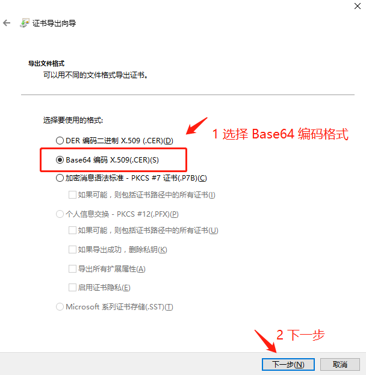
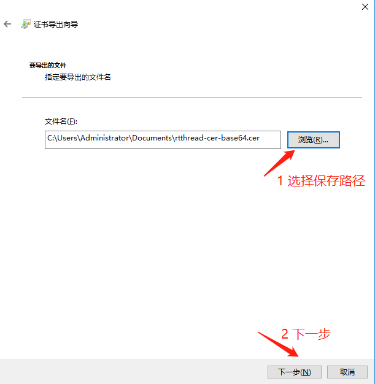

# 使用指南

这里主要介绍 mbedtls 程序的基本使用流程，并针对使用过程中经常涉及到的结构体和重要 API 进行简要说明。

- 初始化 SSL/TLS 上下文
- 建立 SSL/TLS 握手
- 发送、接收数据
- 交互完成，关闭连接

## 功能配置文件

> mbedtls/config.h 和 ports/inc/tls_config.h

`mbedtls/config.h` 是 mbedtls 源码里提供的配置文件，`ports/inc/tls_config.h` 是 RT-Thread 基于 mbedtls 源码中的配置文件进行的裁剪和适配。

最终，用户使用的是 RT-Thread 提供的配置文件 **`ports/inc/tls_config.h`**。

用户可以通过文件中的宏来使能或失能部分不需要使用的功能模块，从而将 mbedtls 配置到合适的尺寸。

## 证书配置文件

> ports/src/tls_certificate.c

该证书文件中已经包含了大多数 CA 根证书，如果您使用的根证书不在该文件内，需要您手动添加根证书文件到 `tls_certificate.c` 文件内。

### 根证书样式

通常，根证书以 `root.cer` 的样式进行命名，双击打开证书文件（Windows系统）可以看到证书的签发机构和有效期，如下图所示：


根证书文件有多种保存格式，我们需要 **`base64 编码 X.509`** 格式的证书文件。该类证书文件使用文本编辑器打后内容样式如下所示：

```
-----BEGIN CERTIFICATE-----
MIIDdTCCAl2gAwIBAgILBAAAAAABFUtaw5QwDQYJKoZIhvcNAQEFBQAwVzELMAkG
A1UEBhMCQkUxGTAXBgNVBAoTEEdsb2JhbFNpZ24gbnYtc2ExEDAOBgNVBAsTB1Jv
b3QgQ0ExGzAZBgNVBAMTEkdsb2JhbFNpZ24gUm9vdCBDQTAeFw05ODA5MDExMjAw
MDBaFw0yODAxMjgxMjAwMDBaMFcxCzAJBgNVBAYTAkJFMRkwFwYDVQQKExBHbG9i
YWxTaWduIG52LXNhMRAwDgYDVQQLEwdSb290IENBMRswGQYDVQQDExJHbG9iYWxT
aWduIFJvb3QgQ0EwggEiMA0GCSqGSIb3DQEBAQUAA4IBDwAwggEKAoIBAQDaDuaZ
jc6j40+Kfvvxi4Mla+pIH/EqsLmVEQS98GPR4mdmzxzdzxtIK+6NiY6arymAZavp
xy0Sy6scTHAHoT0KMM0VjU/43dSMUBUc71DuxC73/OlS8pF94G3VNTCOXkNz8kHp
1Wrjsok6Vjk4bwY8iGlbKk3Fp1S4bInMm/k8yuX9ifUSPJJ4ltbcdG6TRGHRjcdG
snUOhugZitVtbNV4FpWi6cgKOOvyJBNPc1STE4U6G7weNLWLBYy5d4ux2x8gkasJ
U26Qzns3dLlwR5EiUWMWea6xrkEmCMgZK9FGqkjWZCrXgzT/LCrBbBlDSgeF59N8
9iFo7+ryUp9/k5DPAgMBAAGjQjBAMA4GA1UdDwEB/wQEAwIBBjAPBgNVHRMBAf8E
BTADAQH/MB0GA1UdDgQWBBRge2YaRQ2XyolQL30EzTSo//z9SzANBgkqhkiG9w0B
AQUFAAOCAQEA1nPnfE920I2/7LqivjTFKDK1fPxsnCwrvQmeU79rXqoRSLblCKOz
yj1hTdNGCbM+w6DjY1Ub8rrvrTnhQ7k4o+YviiY776BQVvnGCv04zcQLcFGUl5gE
38NflNUVyRRBnMRddWQVDf9VMOyGj/8N7yy5Y0b2qvzfvGn9LhJIZJrglfCm7ymP
AbEVtQwdpf5pLGkkeB6zpxxxYu7KyJesF12KwvhHhm4qxFYxldBniYUr+WymXUad
DKqC5JlR3XC321Y9YeRq4VzW9v493kHMB65jUr9TU/Qr6cf9tveCX4XSQRjbgbME
HMUfpIBvFSDJ3gyICh3WZlXi/EjJKSZp4A==
-----END CERTIFICATE-----
```

### 如何获取根证书

- 直接向服务商索取

  向服务商索取 **`base64 编码 X.509`** 格式的证书文件。

- 从服务商网站导出

    - 浏览器打开服务商网站，以 `https://www.rt-thread.org/` 为例
    - 点击浏览器地址栏的 **`安全`**，然后点击证书

    

    

    

    

    

    

## 初始化 TLS 会话

```c
typedef struct MbedTLSSession
{
    char* host;
    char* port;

    unsigned char *buffer;               // 其它内容缓冲区
    size_t buffer_len;                   // 缓冲区大小

    mbedtls_ssl_context ssl;             // 保存 ssl 基本数据
    mbedtls_ssl_config conf;             // 保存 ssl 配置信息
    mbedtls_entropy_context entropy;     // 保存 ssl 熵配置
    mbedtls_ctr_drbg_context ctr_drbg;   // 保存随机字节发生器配置
    mbedtls_net_context server_fd;       // 保存文件描述符
    mbedtls_x509_crt cacert;             // 保存认证信息
} MbedTLSSession;
```

`MbedTLSSession` 用于保存建立 TLS 会话连接时的配置信息，在 TLS 上下文中传递使用。用户在使用建立 TLS 会话前，必须定义一个存储会话内容的结构体，如下所示：

```c
static MbedTLSSession *tls_session = RT_NULL;
tls_session = (MbedTLSSession *)malloc(sizeof(MbedTLSSession));
```

这里需要设置 SSL/TLS 服务器的 host 和 port，以及数据接收 buffer 等配置。

## 初始化 TLS 客户端

> int mbedtls_client_init(MbedTLSSession *session, void *entropy, size_t entropyLen);

应用程序使用 `mbedtls_client_init` 函数初始化 TLS 客户端。

初始化阶段按照 API 参数定义传入相关参数即可，主要用来初始化网络接口、证书、SSL 会话配置等 SSL 交互必须的一些配置，以及设置相关的回调函数。

实际调用的 mbedtls 库函数如下所示：

```c
mbedtls_net_init(&session->server_fd);
mbedtls_ssl_init(&session->ssl);
mbedtls_ssl_config_init(&session->conf);
mbedtls_ctr_drbg_init(&session->ctr_drbg);
mbedtls_entropy_init(&session->entropy);
mbedtls_x509_crt_init(&session->cacert);
ret = mbedtls_ctr_drbg_seed(&session->ctr_drbg, mbedtls_entropy_func, 
&session->entropy, (unsigned char *)entropy, entropyLen));


mbedtls_ctr_drbg_seed // 可以指定熵函数。如果回调使用默认 bedtls_entropy_func 的话，可以传入一个初始的熵 seed，也可以 NULL
```

## 配置 SSL/TLS 客户端上下文

> int mbedtls_client_context(MbedTLSSession *session);

SSL 层配置，应用程序使用 `mbedtls_client_context` 函数配置客户端上下文信息，包括证书解析、设置主机名、设置默认 SSL 配置、设置认证模式（默认 MBEDTLS_SSL_VERIFY_OPTIONAL）等。

实际调用的 mbedtls 库函数如下所示：

```c
// 解析 mbedtls_root_certificate 缓冲区中存储的根证书，并添加到链表
ret = mbedtls_x509_crt_parse(&session->cacert,
                             (const unsigned char *)mbedtls_root_certificate,
                             mbedtls_root_certificate_len);
// 设置主机名称
ret = mbedtls_ssl_set_hostname(&session->ssl, session->host));
// 设置 SSL 默认配置，选择 SSL 为客户端，使用 TCP
ret = mbedtls_ssl_config_defaults(&session->conf,
                                  MBEDTLS_SSL_IS_CLIENT,
                                  MBEDTLS_SSL_TRANSPORT_STREAM,
                                  MBEDTLS_SSL_PRESET_DEFAULT));
// 设置认证模式，这里默认配置为可选，即认证失败也可以继续通讯
mbedtls_ssl_conf_authmode(&session->conf, MBEDTLS_SSL_VERIFY_OPTIONAL);
// 初始化根证书链表
mbedtls_ssl_conf_ca_chain(&session->conf, &session->cacert, NULL);
// 配置随机数发生器
mbedtls_ssl_conf_rng(&session->conf, mbedtls_ctr_drbg_random, &session->ctr_drbg);
ret = mbedtls_ssl_setup(&session->ssl, &session->conf));
```

## 建立 SSL/TLS 连接

> int mbedtls_client_connect(MbedTLSSession *session);

使用 `mbedtls_client_connect` 函数为 SSL/TLS 连接建立通道。这里包含整个的握手连接过程，以及证书校验结果。

实际调用的 mbedtls 库函数如下所示：

```c
// 创建 socket 描述符
ret = mbedtls_net_connect(&session->server_fd, session->host,
                          session->port, MBEDTLS_NET_PROTO_TCP));
// 设置 socket 输入输出接口
mbedtls_ssl_set_bio(&session->ssl, &session->server_fd,
                    mbedtls_net_send, mbedtls_net_recv, NULL);
// 建立握手连接，这里执行完整的 SSL/TLS 握手认证
ret = mbedtls_ssl_handshake(&session->ssl));
// 获取认证结果
ret = mbedtls_ssl_get_verify_result(&session->ssl));
mbedtls_x509_crt_verify_info((char *)session->buffer,
                             session->buffer_len, "  ! ", ret);
```

## 读写数据

> int mbedtls_client_read(MbedTLSSession *session, unsigned char *buf , size_t len);

> int mbedtls_client_write(MbedTLSSession *session, const unsigned char *buf , size_t len);

注意，如果读写接口返回了一个错误，必须关闭连接。

## 关闭 SSL/TLS 客户端连接

> int mbedtls_client_close(MbedTLSSession *session);

客户端主动关闭连接或者因为异常错误关闭连接，都需要使用 `mbedtls_client_close` 关闭连接并释放资源。

## mbedtls 使用范式

参考示例程序 `samples/tls_app_test.c`。

## 常见问题

### 证书验证失败  

    [tls]verification info: ! The CRL is not correctly signed by the trusted CA

- 原因

    mbedtls 包中支持多种主流 CA 机构根证书，部分 CA 机构未支持

- 解决方法

    若测试其他 TLS 网站证书验证失败，手动获取测试网站根证书（Root Cerificate）添加到`mbedtls/tls_cerificate.c`文件中

### 证书时间错误

    [tls]verify peer certificate fail....
    [tls]verification info:   ! The certificate validity starts in the future

- 原因

    TLS 握手是证书验证需要时间的验证，本地时间获取有误导致

- 解决方式

    检查 RTC 设备是否支持，检查 `RT_USING_RTC` 宏是否打开，校准设备时间。建议使用 NTP 同步本地时间。

### 证书 CN 错误

    verification info: ! The certificate Common Name (CN) does not match with the expected CN

- 原因

    测试其他 TLS 网站时，若输入域名不符合证书的 Common Name（CN）出现 CN 验证失败问题

- 解决方法

    检查输入域名和证书中 CN 是否匹配或输入 IP 地址

### 0x7200 错误

- 原因

    部分原因是因为 mbedTls 收到了大于缓冲区大小的数据包  

- 解决方法

    `menuconfig` 配置增加数据帧大小 ( `Maxium fragment length in bytes` )

```shell
RT-Thread online packages --->
    security packages  --->
        [*] mbedtls: An portable and flexible SSL/TLS library  ---
        [*]   Store the AES tables in ROM
        (2)   Maximum window size used
        (6144) Maxium fragment length in bytes
        [*]   Enable a mbedtls client example
              version (latest)  --->
```

## 参考

- mbedTLS官方网站：https://tls.mbed.org/
- ARMmbed GitHub：[mbedtls](https://github.com/ARMmbed/mbedtls/tree/72ea31b026e1fc61b01662474aa5125817b968bc)
